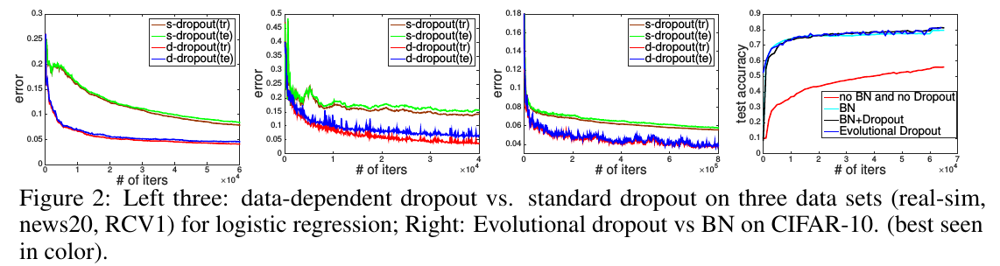

# Paper

* **Title**: Conditional Image Generation with PixelCNN Decoders
* **Authors**: Aaron van den Oord, Nal Kalchbrenner, Oriol Vinyals, Lasse Espeholt, Alex Graves, Koray Kavukcuoglu
* **Link**: http://papers.nips.cc/paper/6527-conditional-image-generation-with-pixelcnn-decoders
* **Tags**: Neural Network,
* **Year**: 2016
* **Cited by**: 49

# Summary

* What
    * This paper expores

* How
    * The authors proposed a data-dependent dropout which depend on the second order statistics of the data distribution.
In practice, the data distribution means data of a batch.
    * They also proposed a evolutional droput which consider about the distribution
of the layer's outputs.
  
* Results

