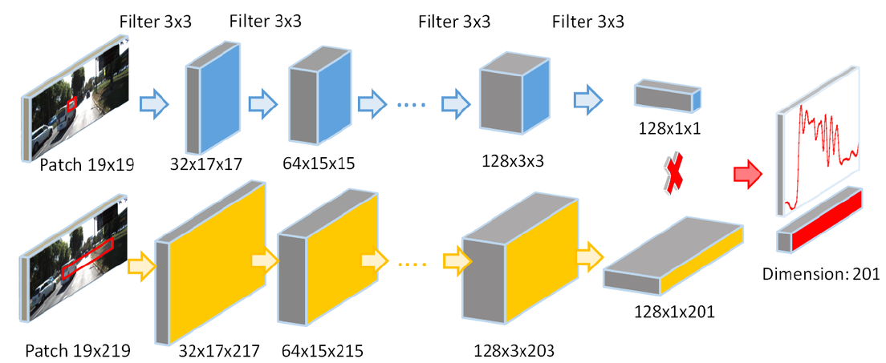

# Paper

* **Title**: Exploiting Semantic Information and Deep Matching for Optical Flow
* **Authors**: Min Bai, Wenjie Luo, Kaustav Kundu, Raquel Urtasun
* **Link**: https://arxiv.org/abs/1604.01827
* **Tags**: Neural Network, matching
* **Year**: 2016
* **Cited by**: 9

# Summary

* What
    * Estimate the traffic participants using instance-level segmentation.
    For each traffic participants, limit the searching space in the horizontal
    and vertical direction. Then use a siamese network to extract features and 
    learn matching.

* How
    * A siamese network with two branches.
    * 
    * [What are Siamese neural networks?](https://www.quora.com/What-are-Siamese-neural-networks-what-applications-are-they-good-for-and-why)
    > Siamese neural network is a class of neural network architectures that contain two or more identical subnetworks. identical here means they have the same configuration with the same parameters and weights. Parameter updating is mirrored across both subnetworks.
    * Optimization function:
    
    * Allow the network less strict in 3 pixels. Set the p(s) as 0.5, 0.2, 0.05, 0
    for the distance with the ground truth as 0, 1, 2, and more pixels.
    * Simply ignore the pixels near the border os the image and do not 
    use them for training.
  
* Experiments
