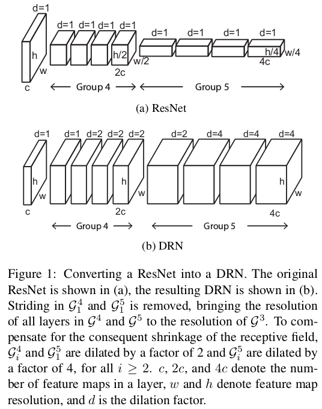
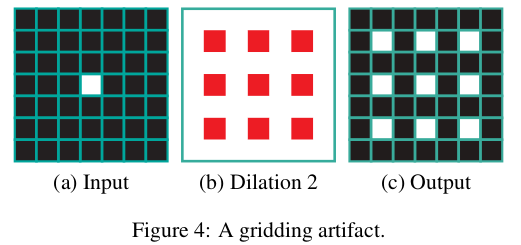

# Paper

* **Title**: Dilated Residual Network
* **Authors**: Fisher Yu, Vladlen Koltun, Thomas Funkhouser
* **Link**: https://pdfs.semanticscholar.org/db29/9ad09f629a0fcd45b74fa567da476d83a4f3.pdf
* **Tags**: Neural Network, Dilated Convolution, Residual Network
* **Year**: 2017
* **Conference**: CVPR2017
* **Cited by**: 2

# Summary

* What
    * Combine dilated covolution with residual network
    * Fixed the gridding artifacts problem introduced by dilated convolution.

* How
    * Modify ResNet to dilated convolutional network.
    * 
    * After the modification, the final output layer from 7\*7 enlarge to 28*28, which the authors
    claim that keep enough details for classification and semantic segmentation.
    * What is gridding artifacts problem?
    * 
    * How to solve this gridding artifacts problem? 
        1. Removing max pooling which leads to high-amplitude high-frequency activations.
        2. Adding more layers at the end of the network with 2 or 1-dilated block convolution.
        3. Removing redisual connections for the extral adding layers.
  
* Experiments
    * Can achieve competitive result with 42 layers when compare with ResNet-101.
    
