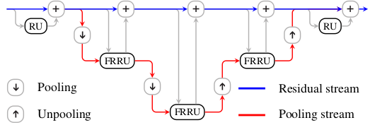
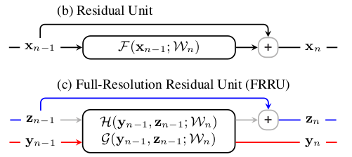
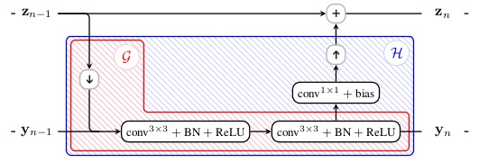

# Paper

* **Title**: Full-Resolution Residual Networks for Semantic Segmentation in Street Scenes
* **Authors**: Tobias Pohlen, Alexander Hermans, Markus Mathias, Bastian Leibe
* **Link**: https://arxiv.org/abs/1611.08323
* **Tags**: Neural Network,
* **Year**: 2016
* **Cited by**: 2

# Summary

* What
    * Multi-scale with Residual.

* How
    * Whole network
    * 
    * Compare residual unit with full-resolution residual unit
    * 
    * Full-resolution redidual unit
    * 
    
  
* Experiments
