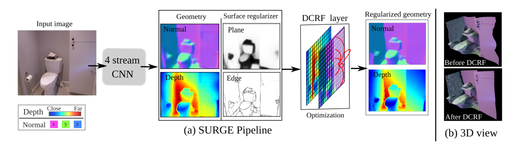

* In pixelCNN, they mentioned that: Feed-forward neural networks with gates have been
explored in previous works, such as highway neworks [25], grid LSTM [13] and neural GPUs [12].
* https://arxiv.org/pdf/1702.00783.pdf. Pixel Recursive Super Resolution. This one use pixelCNN. Pixel level work.

* Short List
    * FastMask: Segment Multi-scale Object Candidates in One Shot
        * **Multi-scale, fit to brain lesion with has large and small segmentation.**
    * End-To-End Instance Segmentation With Recurrent Attention
        * **What is the improve part about only detection?**

* Small object detection/segmentation

* CVPR 2017 **Weakly supervised learning**
    * Robust Interpolation of Correspondences for Large Displacement Optical Flow
    * PointNet: Deep Learning on Point Sets for 3D Classification and Segmentation
        * How to handle the data which are not gride.
    * Convolutional Random Walk Networks for Semantic Image Segmentation
        * addresses the issues of poor boundary localization and spatially fragmented predictions
    * FastMask: Segment Multi-scale Object Candidates in One Shot
        * **Multi-scale**
    * Interpretable Structure-Evolving LSTM
        * **Structural data**
    * SGM-Nets: Semi-Global Matching With Neural Networks
        * **Semi-global matching**
    * Deep Laplacian Pyramid Networks for Fast and Accurate Super-Resolution
        * **An Simple idea**
    * PolyNet: A Pursuit of Structural Diversity in Very Deep Networks
        * **a new dimension beyond just depth and width**
    * WILDCAT: Weakly Supervised Learning of Deep ConvNets for Image Classification, Pointwise Localization and Segmentation
    
* NIPS 2016
    * SURGE: Surface Regularized Geometry Estimation from a Single Image 
        * 
        * **Use learned plane and edge as surface regularizor.**
    * CNNpack: Packing Convolutional Neural Networks in the Frequency Domain
        * **treat deep learning network weights as images. Save the weights in the frequency domain**
    * R-FCN: Object Detection via Region-based Fully Convolutional Networks
        * **R-CNN, faster R-CNN series**
        * **Region Proposal Network (RPN) as the base to generat ROI, then pooling on channel dimention.**
        * **Depending on region proposal.**
    * Collaborative Recurrent Autoencoder: Recommend while Learning to Fill in the Blanks
        * **Recurrent, can it campare with RNN?**
    * Residual Networks Behave Like Ensembles of Relatively Shallow Networks
        * **How to understant redisual networks**
    * Deep Learning without Poor Local Minima
        * **solution space of deep network**
    * A Powerful Generative Model Using Random Weights for the Deep Image Representation
        * **Deep visulization on untrained network?**
    * Generating Images with Perceptual Similarity Metrics based on Deep Networks
        * **Generation with deep learning**
    * Dynamic Filter Networks
        * **filers in DL**
    * On Graph Reconstruction via Empirical Risk Minimization: Fast Learning Rates and Scalability
        * **DL basic: Learning rate and normalization**
    * Optimal spectral transportation with application to music transcription
        * **Can we use it in voice?**
    * Deep Alternative Neural Network: Exploring Contexts as Early as Possible for Action Recognition
        * **Video, 3D. Can we learn something from it?**
        
    * Joint Line Segmentation and Transcription for End-to-End Handwritten Paragraph Recognition 
        * **Anything new for RNN?**
    * SoundNet: Learning Sound Representations from Unlabeled Video
        * **Sound, of course**
    * PerforatedCNNs: Acceleration through Elimination of Redundant Convolutions
        * **redundant, maybe**
    * A Theoretically Grounded Application of Dropout in Recurrent Neural Networks
        * **Random feedback?**
    * Generating Long-term Trajectories Using Deep Hierarchical Networks
        * **Deep Hierarchical?**
        
    * DISCO Nets : DISsimilarity COefficients Networks
        * **Is this one kind of like resNet?**
    * An Architecture for Deep, Hierarchical Generative Models
        * **Hierarchical model**
    * A Powerful Generative Model Using Random Weights for the Deep Image Representation
        * **Generation**
    * Doubly Convolutional Neural Networks
        * **DCNN**
    * Learning to Communicate with Deep Multi-Agent Reinforcement Learning
        * **Reinforcement**
    * Binarized Neural Networks
        * **Bengio**
    * Binarized Neural Networks
        * **New network**
    * Composing graphical models with neural networks for structured representations and fast inference
        * **Graph model?**
    * Synthesizing the preferred inputs for neurons in neural networks via deep generator networks
        * **Generation**
    * Learning Infinite RBMs with Frank-Wolfe
        * **Why we cannot learn infinite RBMs before?**
    * Review Networks for Caption Generation
        
    * FPNN: Field Probing Neural Networks for 3D Data
        * **3D data**
    * Improving Variational Autoencoders with Inverse Autoregressive Flow
        * **VAE**
    * Image Restoration Using Very Deep Convolutional Encoder-Decoder Networks with Symmetric Skip Connections
        * **CNN with encoder?**
    * Learning the Number of Neurons in Deep Networks
        * **How many do we need?**
    * Deep Alternative Neural Network: Exploring Contexts as Early as Possible for Action Recognition
        * **Context**
    * Learning brain regions via large-scale online structured sparse dictionary learning
        * **brain regions**
    * CNNpack: Packing Convolutional Neural Networks in the Frequency Domain
        * **Can we use it in sound?**
    * Learning shape correspondence with anisotropic convolutional neural networks
        * **Shape**
    * Automated scalable segmentation of neurons from multispectral images
        * **Segmentation**
    * Hypothesis Testing in Unsupervised Domain Adaptation with Applications in Alzheimer's Disease
        * **Alzheimer's**
    * Path-Normalized Optimization of Recurrent Neural Networks with ReLU Activations
        * **RNN**
    * Diffusion-Convolutional Neural Networks
        * **Graph CNN**
    * LightRNN: Memory and Computation-Efficient Recurrent Neural Networks
        * **RNN**
    * Combining Fully Convolutional and Recurrent Neural Networks for 3D Biomedical Image Segmentation
        * **CNN and RNN on segmentation**
    * On Multiplicative Integration with Recurrent Neural Networks
        * **RNN, Bengio**
    * Full-Capacity Unitary Recurrent Neural Networks
        * **RNN**
    * Residual Networks Behave Like Ensembles of Relatively Shallow Networks
    * Phased LSTM: Accelerating Recurrent Network Training for Long or Event-based Sequences
    * Automatic Neuron Detection in Calcium Imaging Data Using Convolutional Networks
    * Spatiotemporal Residual Networks for Video Action Recognition
    * Architectural Complexity Measures of Recurrent Neural Networks
    * Variational Autoencoder for Deep Learning of Images, Labels and Captions
    * Generative Shape Models: Joint Text Recognition and Segmentation with Very Little Training Data
    * Professor Forcing: A New Algorithm for Training Recurrent Networks
    * Visual Dynamics: Probabilistic Future Frame Synthesis via Cross Convolutional Networks

