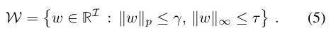

# Paper

* **Title**: Loss Max-Pooling for Semantic Image Segmentation
* **Authors**: Samuel Rota Bulò, Gerhard Neuhold, Peter Kontschieder
* **Link**: https://arxiv.org/abs/1704.02966
* **Tags**: Neural Network,
* **Year**: 2017
* **Cited by**: 0
* **Conference**: CVPR2017

# Summary

* What
    * There are two ways to handle imbalance situation: One is to make the dataset
    balance by collect same quantity samples of each class, or over-sampling the minority classes and
    under-sampling the majority classes. Second method is use different cost function.
    * Authors of this paper propose a method which dynamically re-weighting each pixel and give the pixels
    lead to higher loss larger weight.

* How
    * Learn a convex weight function _W_ which can maximise the loss. 
    * Selecting _W_ for loss is like select pixel in max pooling, so they named it as Loss-Max-Pooling.
    * Predefine the weight function as a _p_norm convex function, and there are two parameters to adjust the function.
    
        * One is Gamma, which means how large this weight function will affect.
        * One is Tao, which means how many pixels in the weight affected area will be applied.
    
    
    
  
* Experiments
   

