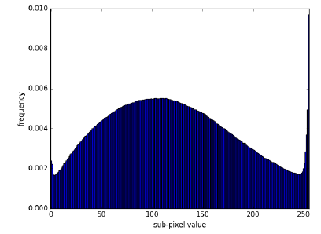
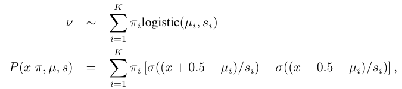
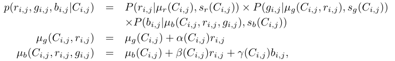
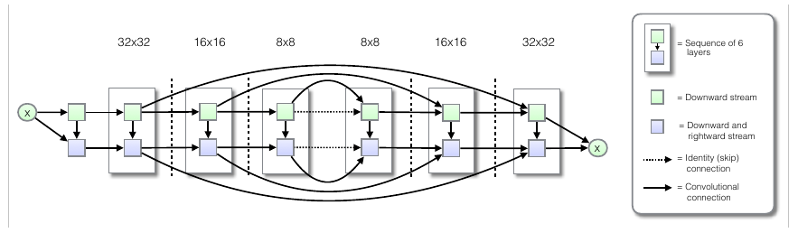

# Paper

* **Title**: PixelCNN++: A PixelCNN Implementation with Discretized Logistic Mixture Likelihood and Other Modifications
* **Authors**: Tim Salimans and Andrej Karpathy and Xi Chen and Diederik P. Kingma and Yaroslav Bulatov
* **Link**: https://openreview.net/pdf?id=BJrFC6ceg
* **Tags**: Neural Network,
* **Year**: 2017
* **Cited by**: 4

# Summary

* What
    * OpenAI implenment pixelCNN with some modifications.
    * 1) Use dicretized logistic mixture likelihood on the pixel rather than a 256-way softmax
    * 2) Condition on whole pixels, rather than R/G/B sub-pixels
    * 3) Use downsampling for multiple resolution
    * 4) Short-cut connections to speed up optimization
    * 5) Dropout for regularization
    
* How
    * 256-way softmax is independent with each other, so the model doesn't know 128 is close to 127 and 129; And also it need
    a lot of memory. So at here they assume there is a continuous distribution for the color intensity, which can be 
    thought as mixture likelihood of logistic. The pixel distribution of CIFAR-10 is like this:
      
    And we factorize the distribution like this:
    

    The authors claims that only small number of mixture components, like 5, is needed for the model.
    * In pixelCNN, for each pixel we consider R/B/G squencially, which means predict R on previous pixels, predict B on previous
    pixels and R, then predict G on previous pixels and R and B. But we don't have to do these so complicated. For a sepcific pixel, 
    the relations between its sub-pixle R/G/B should be very sample. At here the authors of PixelCNN++ only use a linear model.
    
    * In original PixelCNN only use convolutions with small receptive field. And in conditional pixelCNN, it is claimed that if we use
    enough layers then we still can achieve good results. But the authors of pixelCNN++ think that long range dependencies should be better.
    To achieve this goal by using multiple resolutions, original pixelCNN and conditional pixelCNN++ implement dilated convolutions. The authors of pixelCNN++
    propose to use stride 2 convolution to reduce computatipon cost. The downside of using downsampling is it loses information. 
    So the authors introduced short-cut connections for compensation.
    * Short-cut connections like U-net. We can see it is deeper than pixelCNN.
    
    * Dropout. It is implement on the residual path after the first convolution.

* Results
    * Network depth and receptive field. As long as the network has enough capacity, pixelCNN++ with small
    receptive field also can achieve good results. But the author also admit that the image generated in this way lack
    global structure. The authors also introduced two methods to increase network
    capacity. One is insert gated ResNet between covolutional blocks. Second is skip connection between channels.
    * Softmax likelihood vs. distretized logistic mixture. The former model trains more slowly.
    * Continuous logistic likelihood vs. distretized logistic mixture. The latter model performs better in the results.
    * No short-cut connection. Cannot even converge because of losing information in downsampling.
    * No dropout. Obviously it overfits. And also, surprisingly, the overfitted model also cannot generate good images.
